# Orchestrator System

  

## Overview

  

This document outlines the design and implementation of a robust event processing system designed to bridge the gap between a source application and a target GraphQL API. The system handles event ingestion, transformation, rate-limited delivery, and robust error handling, all while ensuring high availability, security, and observability.

  

## Problem Statement

  

The system addresses the challenge of connecting two applications with disparate event processing requirements:

  

### Source Application Characteristics

  

*  **Event Structure:** Sends events with the following JSON structure:

```json

{

"id": "<randomId>",

"name": "test event",

"body": "test body",

"timestamp": "<currentTimestamp>"

}

```

*  **Delivery Guarantees:** Sends each event exactly once.

*  **Performance Requirements:** Requires a 2xx HTTP response within 500ms.

*  **Error Handling:** Does not implement retries on failure.

  

### Target Application Characteristics

  

*  **API Type:** GraphQL API.

*  **Event Structure:** Requires an enriched event structure with an additional `brand` field:

```json

{

"id": "<randomId>",

"name": "test event",

"body": "test body",

"timestamp": "<currentTimestamp>",

"brand": "testBrand"

}

```

*  **Rate Limiting:** Imposes rate limits on event processing.

*  **Throughput Disparity:** The source application may generate events at a higher rate than the target application can consume.

  

## System Architecture

  

The architecture leverages AWS services to create a scalable, resilient, and observable event processing pipeline.

```mermaid

graph LR

  

%% Source Application to API Gateway %%

A[Source Application] -->|"Sends Event (HTTP POST)"| B("AWS API Gateway")

B -->|"Validates & Authenticates"| C["AWS Lambda (Event Processor)"]

  

%% Store Payload in DynamoDB %%

C -->|"Store Payload (Async)"| D("Amazon DynamoDB")

C -->|"Push Event to Queue (Async)"| E("Amazon SQS (Standard Queue)")

  

%% Rate Limited Processing %%

E -->|"Fetch Event (Rate-Limited)"| F("AWS Lambda (Dispatcher)")

F -->|"Enrich Event (Add brand: 'testBrand')"| G("Target Application (GraphQL API)")

G -->|"Response Success"| H("Mark Event as Processed in DB")

  

%% Handling Failures %%

F --x|"Failure (Rate Limit, Error, Timeout)"| I("Retry with Exponential Backoff")

I --x|"Max Retries Reached"| J("Amazon SQS Dead Letter Queue (DLQ)")

  

%% Monitoring & Observability %%

C -->|"Log & Monitor Events"| M("Amazon CloudWatch")

F -->|"Trace Requests"| N("AWS X-Ray")

%% Long Term Storage %%

J -->|"Store Event"| O("Amazon S3")

  

style A fill:#ccf,stroke:#333,stroke-width:2px

style B fill:#ccf,stroke:#333,stroke-width:2px

style C fill:#ccf,stroke:#333,stroke-width:2px

style D fill:#f9f,stroke:#333,stroke-width:2px

style E fill:#f9f,stroke:#333,stroke-width:2px

style F fill:#ccf,stroke:#333,stroke-width:2px

style G fill:#ccf,stroke:#333,stroke-width:2px

style H fill:#f9f,stroke:#333,stroke-width:2px

style I fill:#f9f,stroke:#333,stroke-width:2px

style J fill:#f9f,stroke:#333,stroke-width:2px

style M fill:#cfc,stroke:#333,stroke-width:2px

style N fill:#cfc,stroke:#333,stroke-width:2px

style O fill:#cfc,stroke:#333,stroke-width:2px

```

  




## How it works!!!

### AWS API Server endpoints
```sh
# health endpoint
https://w4rjbcujw2.execute-api.us-east-1.amazonaws.com/prod/events/health

# Use this to send data to the orchestrator
https://w4rjbcujw2.execute-api.us-east-1.amazonaws.com/prod/events
```

### Destination Server endpoints
```sh
# health endpoint
http://ec2-13-218-254-77.compute-1.amazonaws.com:8080

# This is the endpoint that the source application will send data
https://w4rjbcujw2.execute-api.us-east-1.amazonaws.com/prod/events

# Use this to send data to the orchestator
curl http://ec2-13-218-254-77.compute-1.amazonaws.com:8080/send-fake-data -H’X-TARGET-API-URL: https://w4rjbcujw2.execute-api.us-east-1.amazonaws.com/prod/events'
```
##### GraphQL Queries
```sh
http://ec2-13-218-254-77.compute-1.amazonaws.com:8080/graphql

# Fetch a single item
query {
  getItem(id: "12345") {
    id
    name
    body
    timestamp
    brand
  }
}

# Fetch all the items
query {
  getItems {
    id
    name
    body
    timestamp
    brand
  }  
}

# clears the entire database
query {
  clearItems
}

# Create new entries in the sqlite database.
# It is used by the orchestrator 
mutation {
  createItem(
    id: "12345"
    name: "Test Event"
    body: "This is a test body"
    timestamp: 1680451200
    brand: "Test Brand"
  ) {
    id
    name
    body
    timestamp
    brand
  }
}
```


### Considerations - COMPLETED!!!

- System needs to be working in the cloud
- Deployment must be through CI/CD pipeline
- System needs to be secure (authentication)
- System needs to be highly available
- We need to have full visibility on events flowing between `source` and `target` systems
- We need to be able to trace the flow of every single event
- Everything must be covered with tests
- Everything needs to be properly documented, with HLD and LLD included
- System needs to be easy to maintain and support
- All errors/issues need to be visible and handled properly
- We want to see the source code and the working application
- We want to see not only the solution but also how you think and your working process, so please keep all your commits accessible, don't squash them, and use proper naming standards for them

### Required Technology

- Use Node (TypeScript) or GO as a programming language
- Use Terraform to provision the infrastructure
- Use AWS or GCP
